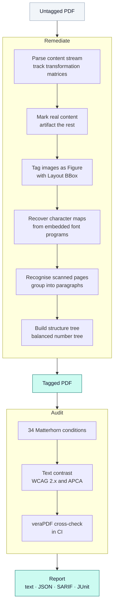

# ADA PDF Remediator

**Most PDFs are unreadable to a screen reader. This fixes what it can, and refuses to lie about the rest.**

[](https://github.com/krishaygarg/ada_pdf_remediation/actions/workflows/ci.yml)
[](https://verapdf.org/)
[](https://pdfa.org/resource/matterhorn-protocol/)
[](https://www.python.org/)
[](LICENSE)

A screen reader does not read a page the way you see it. It follows a tag tree stored inside the file, and most PDFs do not have one. The text is there, but it arrives in whatever order the producer happened to write it, with nothing marking what is a heading, what is a caption, and what is decoration. Academic papers are the worst offenders: two columns interleave, equations interrupt sentences, and figures carry no description at all.

This rebuilds that structure, then audits its own work and tells you what is still wrong.

```bash
pip install -e .
remediate-pdf lecture-notes.pdf accessible.pdf
check-compliance accessible.pdf
```

## The part most tools get wrong

A conformance checker can tell you a document has a `/ToUnicode` map. It cannot tell you the map is any good.

Here is this project's own output, before the work in this series:

```
original    'Physics 7A Discussion 3\nFall 2025\nSept 10–11\nTopic Overview\n• Motion in two...'
remediated  'Physics 7A Discussion 3\nFall 2025\nSept 10{11\nTopic Overview\n Motion in two...'
```

The en dash became an opening brace. The bullets vanished. The increment operator in every formula became a space. And the file scored **100/100** on a commercial accessibility checker, because the character map existed and every code resolved to *something*.

That is the failure mode this project is now built to avoid. A document that passes a checker and cannot be read is worse than one that fails honestly, because nobody goes back to look at it.

It was not the only one. Three defects had survived in this codebase, and each survived because something reported success:

| What was wrong | What it reported |
|---|---|
| The PDF/UA identifier was written to `.../pdfuaid/ns/id/`. ISO 14289-1 clause 5 defines it as `.../pdfua/ns/id/`, so **no conforming validator could identify any output as PDF/UA**. | The local auditor searched for the same wrong URI and confirmed its own bug. axesCheck gave it 100. Only veraPDF caught it. |
| The character map fallback replaced text it could not resolve. `Sept 10–11` became `Sept 10{11`; every `∆`, `−` and bullet vanished. | Both checkers passed it. They verify that codes are mapped, not that the mapping means anything. |
| **No `/Figure` element was ever produced**, despite that being this README's headline feature. Images were tagged as artifacts, so screen readers skipped them entirely. | The interface showed a scorecard asserting full conformance. It was static markup, and the audit result it claimed to summarise was never read. |

[docs/honesty.md](docs/honesty.md) records all three in full, and the design decisions that follow from them.

## What it does



**Rebuilds the tag tree.** Real content is marked, decoration becomes an artifact, and the structure parent tree is built as a balanced number tree so a thousand-page document does not become one array every reader has to scan.

**Recovers character maps from the evidence.** Symbolic fonts, which is essentially everything TeX produces, carry no encoding in the PDF at all. The mapping lives inside the embedded font program, and this reads it: Type 1 built-in encodings, TrueType character maps, CFF charsets, then the Adobe Glyph List, then the `uniXXXX` conventions. A code nothing explains is **left unmapped and counted**, not filled with a space.

**Tags images as figures** with their bounding box in a `/Layout` attribute dictionary, which is where ISO 32000-1 says it goes.

**Recognises scanned pages** using Tesseract's own block and paragraph grouping, so a page becomes paragraphs rather than one structure element per word.

**Measures text contrast**, which the Matterhorn Protocol classifies as needing human judgement. It renders each page and separates glyph pixels from background pixels in CIELAB, then reports both the WCAG 2.x ratio and APCA `Lc`.

## What it will not do

**It will not write alternate text.** A model can produce a plausible sentence about a chart of clinical outcomes, and a plausible sentence is worse than none, because a reader has no way to know it is wrong. Undescribed figures are reported. `--undescribed-images artifact` is available if you would rather they were marked decorative, and the tradeoff is stated where you choose it.

**It will not embed a font it does not have**, or guess what a character code means when nothing in the document says.

**It will not tell you a document is accessible.** It can tell you nothing automatable is wrong with it, which is a different and much smaller claim.

## Honest capability matrix

| | Status |
|---|---|
| Tag tree, marked content, parent tree | Automated |
| PDF/UA-1 identification and metadata | Automated |
| Character map recovery from font programs | Automated |
| Figure tagging with bounding boxes | Automated |
| Link descriptions from the destination | Automated |
| OCR text layer for scanned pages | Automated |
| Contrast measurement (WCAG 2.x, APCA) | Automated |
| Conformance audit, 34 conditions | Automated |
| **Alternate text for figures** | **Needs a person** |
| **Font embedding when absent** | **Not possible from the file** |
| **Reading order in multi-column layouts** | **Research in progress** |
| **Table header associations** | **Not yet implemented** |
| **PDF/UA-2 (ISO 14289-2)** | **Not started** |

## Coverage, stated plainly

The [Matterhorn Protocol 1.1](https://pdfa.org/resource/matterhorn-protocol/) defines **31 checkpoints and 136 failure conditions** for PDF/UA-1. Of those, **87 can be determined by software**, 47 need human judgement, and 2 have no defined test.

This implements **34 conditions across 17 of the 31 checkpoints**. `check-compliance --list-rules` prints them with their ISO clause and WCAG cross-reference, and `coverage_summary()` reports the gap rather than implying there is none.

Every rule names the condition it implements:

```
[FAIL] 10-003  The /ToUnicode map for NTDRFR+CMR12 sends 162 of 256 codes to a
               space or replacement character.
       at object 8
       fix: Derive the mapping from the font's own encoding and glyph names.
```

## Verified against something other than itself

An auditor written by the same people as the writer it audits is not evidence. This project proved that the hard way: the old checker looked for the PDF/UA identifier under the same wrong namespace the pipeline wrote, so it confirmed the defect and reported full compliance.

CI now validates every produced document with [veraPDF](https://verapdf.org/), the reference implementation, and cross-checks the two engines against each other. The invariant is directional: **if veraPDF rejects a document, this engine must not call it clean.**

## Usage

```bash
# Remediate
remediate-pdf input.pdf output.pdf
remediate-pdf input.pdf output.pdf --traceback

# Audit
check-compliance output.pdf                     # human readable
check-compliance output.pdf --format sarif      # annotates a GitHub pull request
check-compliance output.pdf --contrast          # also measure text contrast
check-compliance output.pdf --only 13 --only 15 # figures and tables only
check-compliance --list-rules

# Benchmark reading order strategies
ada-ro-bench datasets/example.jsonl
```

```python
from remediator import remediate_single_pdf
from remediator.compliance import audit

remediate_single_pdf("input.pdf", "output.pdf")
report = audit("output.pdf")

print(report.conformant)
for finding in report.errors:
    print(finding.condition, finding.message, finding.remedy)
```

Run it as a service with `docker compose up`, or `gunicorn app:app`. Documents are processed as tracked jobs, progress streams over server-sent events, and uploads are deleted after an hour.

## Installing

```bash
python3 -m venv .venv && source .venv/bin/activate
pip install -e ".[dev]"
```

System dependencies for the OCR path:

```bash
brew install poppler tesseract          # macOS
sudo apt install poppler-utils tesseract-ocr   # Debian and Ubuntu
```

`make check` runs everything CI runs. `make demo` remediates the bundled sample and audits the result.

## Research

Two tracks are active, with their specifications under [`docs/planning/`](docs/planning/):

**[Layout and reading order recovery](docs/planning/layout_reading_order_proposal.md).** A zero-labelling approach combining spatial heuristics with pre-trained models. `ada-ro-bench` benchmarks strategies against a `stream-order` baseline and CI posts the leaderboard on every relevant pull request.

**[Technical image alt text](docs/planning/alt_text_research_spec.md).** Lightweight vision-language models for formulas and charts. `remediator.alttext` defines the provider interface; a model plugs in through an entry point without touching the pipeline.

[CONTRIBUTING.md](CONTRIBUTING.md) has the full backlog, including roughly 53 unimplemented Matterhorn conditions that are each one function and one fixture.

## Licence

MIT. See [LICENSE](LICENSE).
