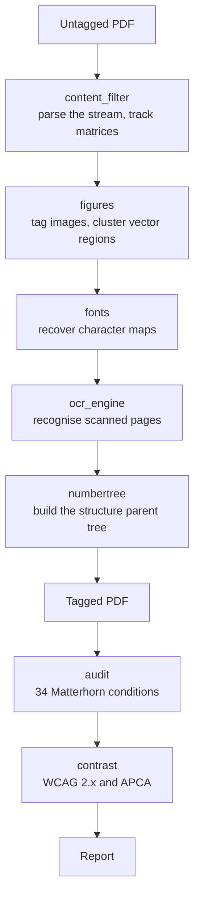

# Architecture

## How a document moves through

## Packages

| Package | Responsibility |
|---|---|
| `remediator.pipeline` | Orchestration. Owns the page loop and the structure tree. |
| `remediator.content_filter` | Parses content streams, tracks the transformation and text matrices, classifies operators, and collects geometry. |
| `remediator.fonts` | Recovers character code to text mapping from every source the document offers, in order of authority. |
| `remediator.figures` | Detects figures and builds their structure elements. |
| `remediator.alttext` | The provider interface for figure descriptions. Contains no model. |
| `remediator.ocr_engine` | Invisible text layer for scanned pages, grouped into paragraphs. |
| `remediator.numbertree` | Balanced PDF number trees with their invariants. |
| `remediator.audit` | The conformance rule engine and its report formats. |
| `remediator.contrast` | Text contrast measurement against WCAG 2.x and APCA. |
| `remediator.geometry` | Shared spatial primitives. |
| `remediator.roeval` | Reading order benchmark harness. Contains no ordering algorithm. |
| `remediator.service` | The HTTP service, job store and event stream. |
| `remediator.progress` | Structured progress events. |

## Two orderings, only one of which is the reading order

This trips people up, and getting it backwards silently breaks the document.

The **structure parent tree** maps a page's `/StructParents` key to an array **indexed by marked-content identifier**. Its order is fixed by the content stream. Annotations occupy the same key space but resolve to a single element rather than an array, which is why they draw from a counter starting above the last page.

The **document element's `/K` array** is the logical sequence a screen reader follows. Changing the reading order means reordering this, and only this.

## Adding a conformance rule

One function, one metadata literal, one fixture. Drop it in a module under `remediator/audit/rules/`; the registry imports the package automatically. See [the rule catalogue](reference/rules.md) for what exists.
